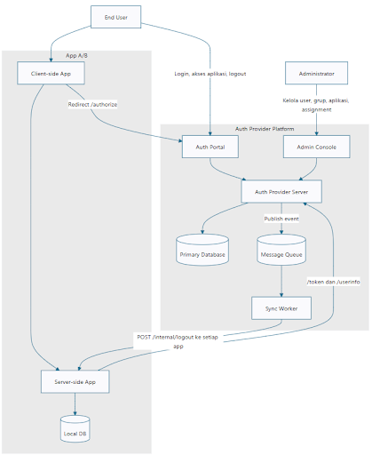
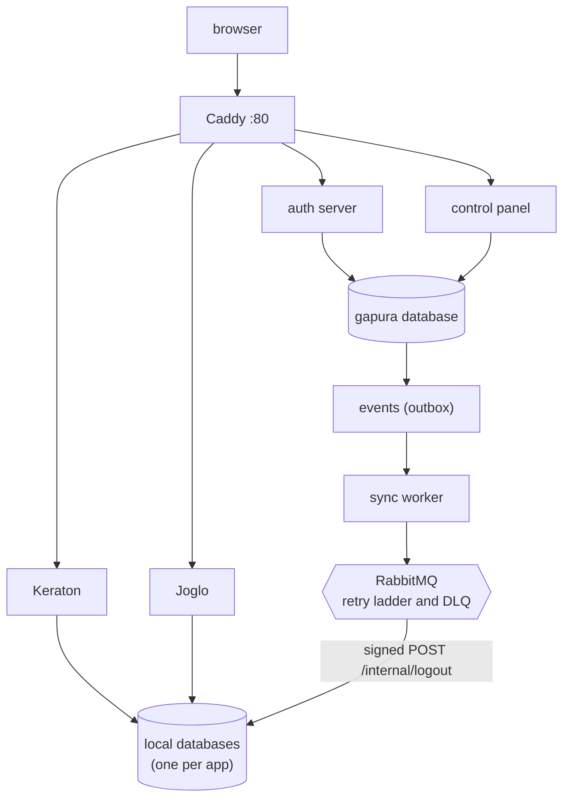
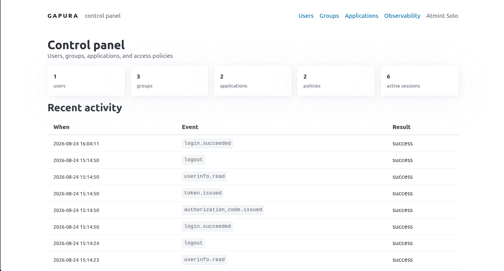
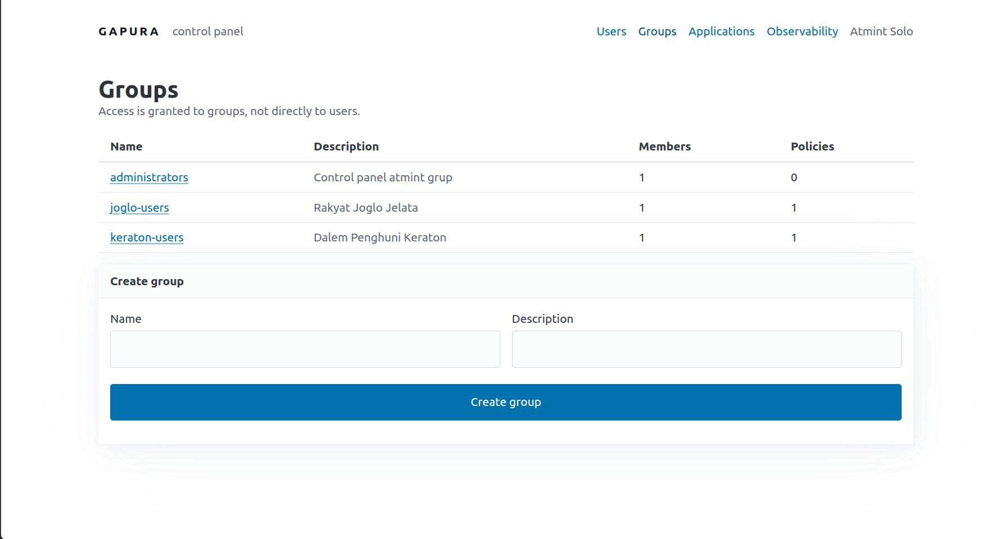
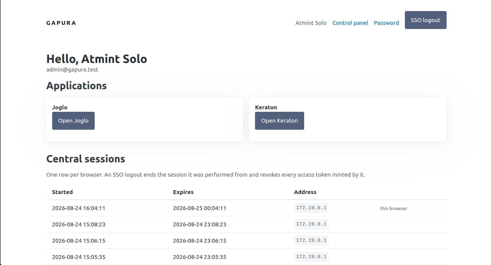
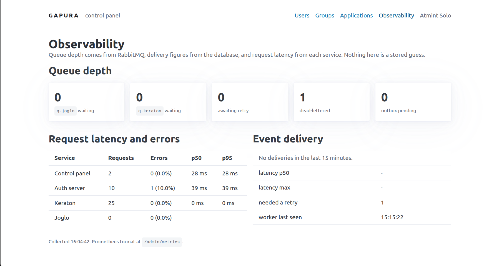
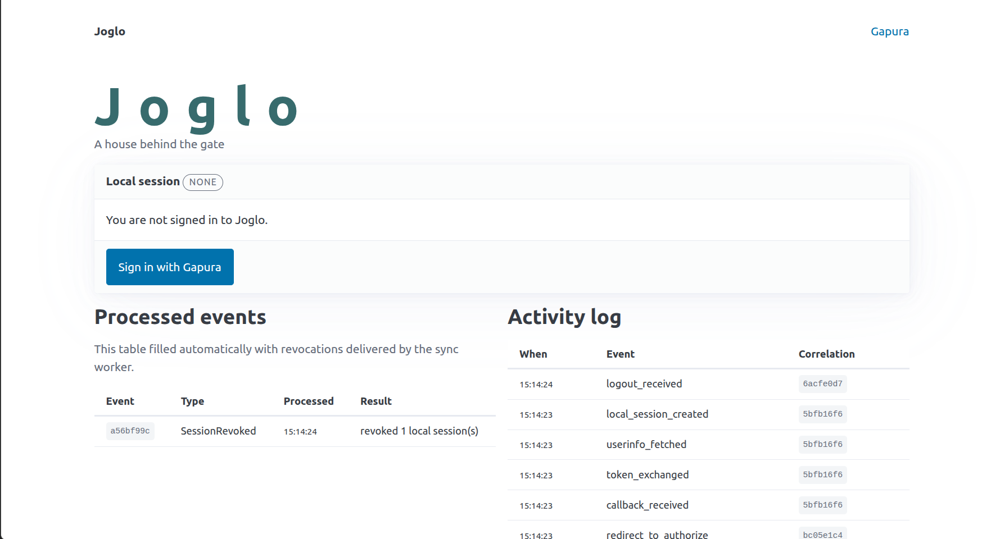
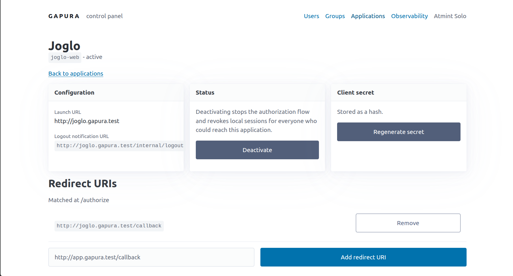
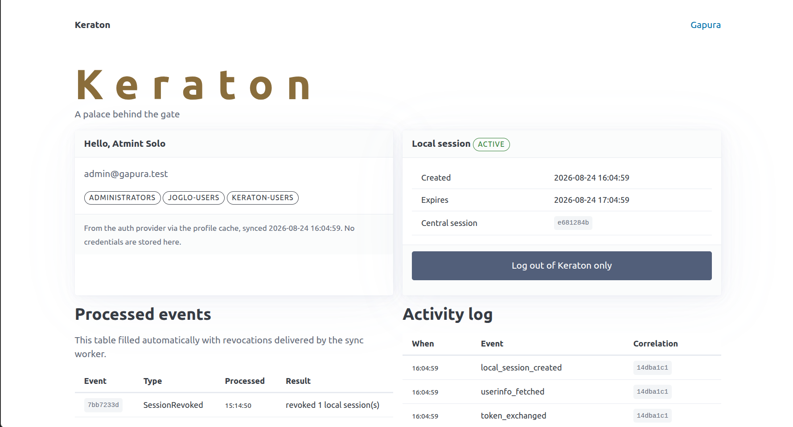
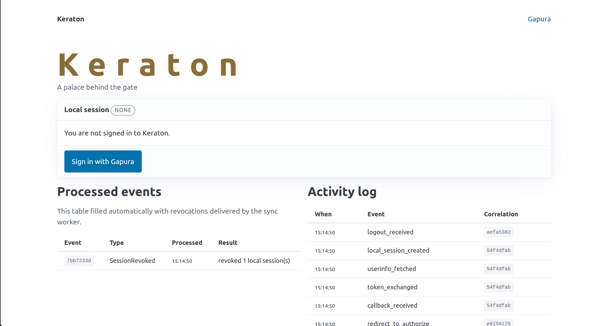

# Gapura

## Tugas Seleksi 2 Laboratorium Pemrograman 2026

**Made by Muhammad Akmal (13524099)**

**Gapura** is a centralized identity and authorization provider. It authenticates a user once, propagates access to multiple applications through an OAuth2 authorization-code flow, and revokes sessions asynchronously through a message queue.

## Build and Run

### 1. Hostname Setup

There's three main services: the authentication provider (**Gapura**) and two relying applications (**Joglo** and **Keraton**), reached by name set custom. In UNIX-based system, add this line to `/etc/hosts`:

```
127.0.0.1  auth.gapura.test keraton.gapura.test joglo.gapura.test
```

Run this command in a shell:

```sh
sudo sh -c 'printf "\n# Gapura Local Development\n127.0.0.1  auth.gapura.test keraton.gapura.test joglo.gapura.test\n" >> /etc/hosts'
```

### 2. Environment Configuration

Copy the environment variable template and fill it with real secrets:

```sh
cp .env.example .env
```

Generate secrets with `openssl rand -base64 32`, keep `.env` is gitignored. To showcase lifetime value for cookies, adjust value in the corresponding variable value.

Every value is read from the environment. Nothing is hardcoded, and no secret is
committed.

| Variable | Default | Meaning |
|---|---|---|
| `POSTGRES_USER`, `POSTGRES_PASSWORD` | — | Database credentials |
| `POSTGRES_HOST`, `POSTGRES_PORT` | `postgres`, `5432` | Database location, as seen from inside the compose network |
| `RABBITMQ_USER`, `RABBITMQ_PASSWORD` | — | Broker credentials |
| `RABBITMQ_HOST`, `RABBITMQ_PORT` | `rabbitmq`, `5672` | Broker location (AMQP) |
| `RABBITMQ_MANAGEMENT_URL` | `http://rabbitmq:15672` | Management API, read by readiness probes and the metrics dashboard |
| `AUTH_ISSUER` | `http://auth.gapura.test` | Canonical auth provider URL. One string, identical from the browser, from an application backend, and from the worker |
| `KERATON_BASE_URL`, `JOGLO_BASE_URL` | — | Each application's own canonical URL |
| `SEED_ADMIN_NAME`, `SEED_ADMIN_EMAIL`, `SEED_ADMIN_PASSWORD` | — | The first administrator, created once by the migrator |
| `KERATON_CLIENT_ID`, `JOGLO_CLIENT_ID` | — | OAuth client identifiers |
| `KERATON_CLIENT_SECRET`, `JOGLO_CLIENT_SECRET` | — | Client secrets. Only an Argon2 hash reaches the database |
| `LOGOUT_SIGNING_SECRET_KERATON`, `LOGOUT_SIGNING_SECRET_JOGLO` | — | HMAC keys shared by the sync worker and each application, for `/internal/logout` |
| `AUTH_CODE_TTL_SECONDS` | `60` | Authorization code lifetime |
| `ACCESS_TOKEN_TTL_SECONDS` | `300` | Access token lifetime |
| `CENTRAL_SESSION_TTL_SECONDS` | `28800` | Central (SSO) session lifetime |
| `LOCAL_SESSION_TTL_SECONDS` | `3600` | Local session lifetime, per application |
| `OUTBOX_POLL_INTERVAL_MS` | `500` | How often the relay looks for pending events |
| `OUTBOX_BATCH_SIZE` | `20` | Events claimed per poll |
| `DELIVERY_TIMEOUT_MS` | `5000` | Timeout on a single delivery attempt |
| `LOG_LEVEL` | `info` | Pino log level |

`LOGOUT_SIGNING_SECRET_*` is **not** the client secret. The database stores only a hash
of the client secret, and you cannot sign with a value you cannot recover, so signing
uses a separate secret that is never persisted.

The retry ladder (1s, 2s, 4s, 8s, 16s, then dead-letter) is fixed in code rather than
configured, so the number of attempts and the set of declared delay queues cannot drift
apart.

### 3. Start Docker

```sh
docker compose up
```

Every service will up after a few minutes. A `migrator` service will automatically runs migrations for all three databases and seeds the first admin, both applications, and their access policies, then exits. Sign in at `http://auth.gapura.test` with `SEED_ADMIN_EMAIL` and `SEED_ADMIN_PASSWORD` from environment variable.

Startup order is enforced by compose conditions: Postgres and RabbitMQ must report healthy, the `migrator` must exit successfully, and only then do the four application services start. The first run also builds the images, so it takes noticeably longer than subsequent ones.

### 4. Migrations and Seeding

Migrations never run from a service entrypoint. Three processes share the `gapura`
database, so they would race each other on startup; `migrator` is the single owner of
schema changes for all three databases and runs once, before anything else starts
([docker/migrate-all.sh](docker/migrate-all.sh)):

```sh
prisma migrate deploy   # gapura (auth provider)
prisma migrate deploy   # keraton (relying app A)
prisma migrate deploy   # joglo (relying app B)
node auth-provider/core/dist/seed.js
```

The three databases are created on first boot of the Postgres volume by
[docker/postgres-init.sh](docker/postgres-init.sh).

Seeding ([auth-provider/core/src/seed.ts](auth-provider/core/src/seed.ts)) is written
entirely with upserts, so re-running it is safe. It creates:

- the `administrators` group, and the admin user from `SEED_ADMIN_*` as its member;
- the groups `keraton-users` and `joglo-users`;
- the applications **Keraton** and **Joglo**, with `client_secret_hash`, `launch_url`,
  and `logout_notification_url` (`{base}/callback` is registered as the only redirect
  URI);
- one `allow` policy per application, granted to its matching group;
- membership of the seeded admin in both application groups, so the first sign-in
  reaches both applications immediately.

There is no role column anywhere. Administrative capability is membership in the
`administrators` group, re-checked on every request to `/admin`.

### 5. Component URLs

| Address | Component |
|---|---|
| `http://auth.gapura.test` | Auth server: login, `/authorize`, `/token`, `/userinfo`, SSO logout, change password |
| `http://auth.gapura.test/admin` | Admin control panel, a separate process on the same origin |
| `http://auth.gapura.test/admin/observability` | Metrics dashboard |
| `http://keraton.gapura.test` | Relying application A |
| `http://joglo.gapura.test` | Relying application B |
| `http://localhost:15672` | RabbitMQ management UI (queues, DLQ) |
| `localhost:5432` | PostgreSQL, bound to loopback only |

Caddy on port 80 is the only ingress. The sync worker has no route through it: its probe
server is reachable only from inside the compose network.

The control panel shares the auth server's origin on purpose. The SSO cookie is
host-only, so a separate hostname would put `/admin` outside its scope and force the
panel to become an OAuth client, which it must not be.

### 6. Verifying the stack

```sh
docker compose ps
curl -s http://auth.gapura.test/health/ready | jq
curl -s http://keraton.gapura.test/health/ready | jq
```

Liveness and readiness answer different questions, and the difference is observable:

```sh
docker compose stop postgres
curl -s http://auth.gapura.test/health/live     # 200, still alive
curl -s http://auth.gapura.test/health/ready    # 503, names the failing component
docker compose start postgres                   # recovers without a restart
```

Stopping a service drains it rather than killing it: `docker compose stop` returns well
inside the 30s grace period and every service exits `0`.

### 7. Local development

Docker Compose is the supported way to run the whole system. For working on a single
service, Postgres and RabbitMQ publish on loopback, so one process can run on the host
against the containerized stack.

```sh
pnpm install
pnpm -r run generate     # Prisma 7 generates into source, not node_modules
pnpm -r build
pnpm -r test
pnpm --filter @gapura/auth-server dev
```

Requires Node 22 and pnpm 11. Tests cover the two places where a bug would be silent
rather than loud: constant-time comparison and HMAC verification in `packages/crypto`,
and the `AccessPolicyChanged` snapshot diff in `auth-provider/core`.

## System Architecture



### Components

| Service | Process | Responsibility |
|---|---|---|
| `proxy` | Caddy 2 | The only ingress; routes the three hostnames, and `/admin*` to the control panel |
| `auth-server` | `@gapura/auth-server` | Credentials, central sessions, policy evaluation, authorization codes, tokens, user info, SSO logout |
| `control-panel` | `@gapura/control-panel` | Admin CRUD for users, groups, applications, policies; metrics dashboard |
| `sync-worker` | `@gapura/sync-worker` | Outbox relay (DB → queue) and delivery consumer (queue → applications) |
| `keraton`, `joglo` | `@gapura/oauth-client` | Relying applications: local sessions, profile cache, processed events |
| `postgres` | PostgreSQL 18 | Three databases: `gapura`, `keraton`, `joglo` |
| `rabbitmq` | RabbitMQ 3 | Event transport, retry ladder, dead-letter queue |
| `migrator` | one-shot | Migrations and seeding, then exits |



### Login flow

1. The browser hits a relying application. With no valid local session it shows a sign-in
   button pointing at the application's own `/login`.
2. `/login` mints a `state` value, stores it in a short-lived host-only cookie, and
   redirects to `AUTH_ISSUER/authorize` with `response_type=code`, `client_id`,
   `redirect_uri`, and `state`.
3. `/authorize` resolves the central session from the SSO cookie. If there is none, it
   redirects to `/login?next=<the original /authorize request>` and resumes exactly that
   request after the password is verified.
4. Policy evaluation runs in order: client known → application active → redirect URI
   registered exactly → user active → an `allow` policy links one of the user's groups to
   the application. A denial writes an audit row carrying the internal reason and never
   shows it to the caller.
5. On success a single-use authorization code is created (hash stored, 60s TTL) inside the
   same transaction as its audit row, and the browser is redirected back with `code` and
   `state`.
6. The application compares `state` in constant time, then exchanges the code
   server-to-server at `POST /token` using HTTP Basic client authentication. The exchange
   is atomic: the code row is claimed with a conditional update, so a replay finds it used
   and fails.
7. The application calls `GET /userinfo` with the access token, caches the profile, and
   creates its own local session — including the `sso_session_id` returned by `/token`.
8. The page greets the user from the profile cache. Identity never travels through the
   browser callback; only the authorization code does.

### Revocation flow

Central session revocation is synchronous. Propagation to applications is not.

1. A revoking action (SSO logout, password change, admin deactivation, policy change)
   revokes the session **and** inserts the outbox row in **one transaction**. Nothing
   publishes to the queue inline: publishing after commit would leave a window where the
   process dies and the event is lost, which is the failure the outbox pattern exists to
   prevent.
2. The relay in the sync worker polls `events` every `OUTBOX_POLL_INTERVAL_MS`, claiming a
   batch with `FOR UPDATE SKIP LOCKED`, fans each event out into one message per target
   application (all sharing the one `eventId`), creates one `event_deliveries` row per
   target, and marks the event published.
3. The consumer takes one message at a time (`prefetch(1)`), looks up the target's
   `logout_notification_url`, and POSTs the signed notification.
4. Success updates that application's delivery row to `succeeded` and acks. Failure
   records the error, republishes to the next delay queue, and acks — the retry ladder is
   the queue's job, not a sleeping consumer's.
5. After 6 attempts the message goes to the dead-letter exchange and the delivery row
   reads `failed`, with `last_error`.

| Event | Emitted when | Applications notified | Local sessions destroyed |
|---|---|---|---|
| `SessionRevoked` | SSO logout, admin revokes a session, user deactivated | all active | those matching `central_session_id` |
| `PasswordChanged` | a user changes their own password | all active | all sessions for that user |
| `AccessPolicyChanged` | a group or policy change removes access | only the affected one | all sessions for that user |

`SessionRevoked` matching on **central session** rather than user is what keeps one
browser's logout from ending every other session for the same person.

`AccessPolicyChanged` has no natural trigger and must be computed. Inside the transaction
of every mutation that can take reach away — removing a membership, removing a policy,
deleting a group, deactivating an application — the set of reachable `(user, application)`
pairs is snapshotted before and after, and one event is emitted per pair that disappeared.

### Broker topology

| Object | Kind | Purpose |
|---|---|---|
| `gapura.events` | direct exchange | Routing key is the application key (`keraton`, `joglo`) |
| `q.keraton`, `q.joglo` | durable queues | One per registered application — a failure in one never blocks the other |
| `gapura.retry.{1s,2s,4s,8s,16s}` | fanout exchanges | One per rung of the retry ladder |
| `q.retry.{1s,2s,4s,8s,16s}` | durable queues | `x-message-ttl` per rung, dead-lettering back to `gapura.events` when it expires |
| `gapura.dlq` → `q.dlq` | fanout exchange | Terminal failures, kept for inspection |

Messages are published persistent, and every attempt is recorded per application in
`event_deliveries`.

### Idempotency and correlation

Every application copy of an event shares one `eventId`. Each application records it in
`processed_events` (primary key), so a redelivery returns `already_processed` and repeats
no work — which is what makes at-least-once delivery safe.

An `x-request-id` is generated or accepted at every HTTP edge, echoed on the response,
carried into audit rows and activity logs, and forwarded across service-to-service calls
and into the event payload's `metadata.correlationId`, so one user action can be followed
end to end.

### Health, metrics, and shutdown

- `GET /health/live` touches no dependency, which is what keeps it green during someone
  else's outage. `GET /health/ready` checks Postgres (`SELECT 1`) and the broker
  (management API), plus consumer state on the worker, each with a 2s timeout, and returns
  `503` naming the failing component.
- Every service exposes Prometheus text at `/metrics` and a small JSON summary at
  `/internal/metrics.json`. The dashboard at `/admin/observability` aggregates those peers
  with live RabbitMQ queue depths and delivery statistics computed from the database.
- `SIGTERM` and `SIGINT` start a graceful shutdown: flip readiness to draining, stop
  accepting work, finish what is in flight, then close the broker and database. The worker
  additionally cancels its consumers and drains in-flight deliveries first. Compose allows
  30s; the shutdown controller gives up at 25s.

## Decisions

### Opaque access tokens, not JWTs

Access tokens are 32 random bytes, base64url-encoded, stored only as a SHA-256 hash, and
bound to one user, one application, and one central session.

The requirement that decides this is revocation. A JWT is valid because it verifies, so it
stays valid until it expires; making an SSO logout effective would require a revocation
list consulted on every use — which is the database round-trip a JWT is meant to avoid,
plus signing keys to distribute and rotate. An opaque token has no such gap: `/userinfo`
re-reads the token row and re-checks token status and expiry, the owning central session's
status, `revoked_at`, and expiry, and the user's status. Revocation is immediate by
construction.

The costs are real and accepted: every validation is a database round-trip, the auth
provider is on the critical path for every profile read, and applications cannot validate
offline. Both are bounded here by a 5-minute token TTL and by applications reading
`/userinfo` once, at login, into a profile cache. Tokens are audience-bound by
`application_id`, so a token minted for Keraton is not a token for Joglo.

### RabbitMQ as the message broker

The delivery semantics needed are per-message: acknowledge one delivery, retry that one
message on a delay, and dead-letter it alone when attempts run out, without holding up
anything behind it.

RabbitMQ gives all three natively. The retry ladder is built from broker primitives rather
than application code — five delay queues with `x-message-ttl` and a dead-letter exchange
pointing back at the main exchange, so a failed message *waits in the broker* and the
consumer never sleeps. A direct exchange with one queue per application is what makes
"Joglo is down" invisible to Keraton. The management API doubles as the source for
readiness checks and for the queue depths on the dashboard, which is what lets the
observability numbers be real rather than stored guesses.

Kafka was the alternative considered. Its partitioned log is excellent for ordered replay,
but redelivery is offset-based rather than per-message, there is no native per-message
delay or DLQ, and a stuck message blocks its partition — the opposite of the isolation
this system needs. Redis lists or streams would need durable acknowledgement, retry, and
dead-lettering written by hand.

### HMAC request signing for `/internal/logout`

The sync worker authenticates to each application with a shared-secret signature, not a
bearer credential:

- HMAC-SHA256 over `{timestamp}.{raw request body}`, sent as `x-gapura-signature` with
  `x-gapura-timestamp`.
- The receiver re-reads the **raw** body (a dedicated content-type parser keeps it
  byte-for-byte; re-serializing a parsed object would not reproduce it), recomputes the
  MAC, and compares in constant time.
- Timestamps older or newer than 300s are rejected, which bounds replay.
- Each application has its own secret, so one application cannot forge notifications to
  the other.

The signature covers the body, so it authenticates *this* request rather than merely
identifying the caller: a captured header cannot be reused to revoke a different session.
The client secret could not have been reused for this — the database stores only its
Argon2 hash, and you cannot sign with a value you cannot recover — hence a separate
`LOGOUT_SIGNING_SECRET_*` per application. mTLS would give stronger guarantees at the cost
of a certificate authority and rotation machinery well beyond this system's scope.

### Soft delete for identity, hard delete for relationships

Rows are split by whether they carry history.

**Never deleted, deactivated instead.** Users and applications have a `status` of `active`
or `inactive`. There is no delete route for either. Deactivating a user revokes every
central session, emits `SessionRevoked` per revoked session, and blocks new authorization
codes; deactivating an application stops the authorization flow and code exchange, and the
access diff emits `AccessPolicyChanged` for everyone who has just lost reach. Deleting them
would orphan the audit trail that must explain what happened, and would free a unique email
or `client_id` for reuse by a different identity later — the exact ambiguity an audit log
exists to prevent. Sessions and tokens follow the same rule: revocation writes `status`,
`revoked_at`, and `revoke_reason` rather than removing the row, which is why a signed-out
application can still say *why* the session ended.

**Hard deleted.** Groups, group memberships, access policies, and redirect URIs are joins
and configuration: they express the current state of a relationship, not a historical fact.
A deleted membership means "not a member", and a lingering soft-deleted row would need
filtering out of every policy query, where forgetting the filter once silently grants
access. Each such deletion runs inside the access-diff transaction, so the loss of reach
is captured as an event even though the row is gone, and an audit row records the change.

`audit_logs` is deliberately unconstrained — its `user_id`, `actor_id`, `application_id`,
and `session_id` are plain columns with no foreign keys — so an audit row survives whatever
it refers to. The same reasoning applies to `processed_events` in each application: those
rows are the idempotency key and are never cleaned up.

### Other choices worth naming

| Choice | Why |
|---|---|
| Control panel as a separate process on the same origin | The SSO cookie is host-only. A separate hostname would put `/admin` outside its scope and force the panel to become an OAuth client, which it must not be |
| One database per relying application | Real isolation of local sessions between App A and App B, without three Postgres instances |
| Transactional outbox, polled by the worker | The revocation and the event commit together, so no crash can lose an event that a user already saw take effect |
| Argon2id for passwords and client secrets | Memory-hard by default; failed sign-ins for unknown emails still run a verification to keep timing flat |
| Server-rendered Eta templates with htmx polling | The asynchronous propagation is something you watch happen, not something a page tells you about |

## Tech Stack

| Layer | Choice | Version |
|---|---|---|
| Runtime | Node.js | 22 (`node:22-bookworm-slim`) |
| Language | TypeScript | 5.9 |
| Package manager | pnpm workspaces | 11.9.0 |
| HTTP | Fastify (`@fastify/cookie`, `@fastify/formbody`, `fastify-plugin`) | 5.6 |
| Views | Eta templates + htmx | 4.1 / 2.0.4 |
| ORM | Prisma + `@prisma/adapter-pg` | 7.9.1 |
| Database | PostgreSQL | 18 (alpine) |
| Broker | RabbitMQ + `amqplib` | 3-management / 0.10 |
| Passwords | `@node-rs/argon2` (Argon2id) | 2.0 |
| Metrics | `prom-client` | 15.1 |
| Logging | Pino (Fastify logger) | 9.13 |
| Ingress | Caddy | 2 (alpine) |
| Orchestration | Docker Compose | — |

### Repository layout

```
gapura/
├── auth-provider/
│  ├── core/            gapura schema, generated client, domain services, seed
│  ├── server/          login, /authorize, /token, /userinfo, SSO logout
│  ├── control-panel/   admin CRUD and dashboard, its own process, served at /admin
│  └── sync-worker/     outbox relay, queue consumer, probe server
├── applications/
│  ├── keraton/         config plus a colour over oauth-client
│  └── joglo/           the same, in a different colour
├── packages/
│  ├── contracts/       event payloads, error shape, shared enums
│  ├── crypto/          Argon2, SHA-256, HMAC, constant-time compare
│  ├── http-kit/        request id, error handler, health, metrics plugins
│  ├── lifecycle/       readiness checks, graceful shutdown, RabbitMQ management client
│  └── oauth-client/    the entire relying-app half, config-driven
├── docker/             Dockerfiles, database init, migration entrypoint
├── docs/               specification and architecture diagram
└── docker-compose.yml
```

Three databases means three Prisma schemas and three generated clients. Keraton and Joglo
are ~90% identical, and that shared half lives in `packages/oauth-client`, so each
application is a config object and an accent colour.

## Endpoints

### Auth server — `http://auth.gapura.test`

| Method | Path | Purpose |
|---|---|---|
| `GET` | `/` | Session home: the user's active central sessions and launch links for the registered applications |
| `GET` | `/login` | Sign-in form; `?next=` carries the request to resume |
| `POST` | `/login` | Verify credentials, create the central session, set the SSO cookie |
| `GET` | `/authorize` | Authorization endpoint: validates `client_id` and `redirect_uri`, evaluates policy, issues a single-use code |
| `POST` | `/token` | `authorization_code` grant → opaque access token; client auth via HTTP Basic or request body |
| `GET` | `/userinfo` | Bearer access token → `sub`, `name`, `email`, `groups` |
| `POST` | `/logout` | SSO logout: revokes this browser's central session, emits `SessionRevoked` |
| `GET` | `/password` | Change-password form (self-service only) |
| `POST` | `/password` | Change password: revokes every central session for the user, emits `PasswordChanged` |
| `GET` | `/health/live` | Liveness — no dependencies touched |
| `GET` | `/health/ready` | Readiness — database and broker, `503` with details when unhealthy |
| `GET` | `/metrics` | Prometheus text format |
| `GET` | `/internal/metrics.json` | Request rate, error rate, p50/p95 summary |

### Control panel — `http://auth.gapura.test/admin`

Every route below requires a valid central session whose user is in the `administrators`
group; anything else redirects to sign-in or renders `403`. The health and metrics paths
are the exception and are reachable unauthenticated, for probes and scraping.

| Method | Path | Purpose |
|---|---|---|
| `GET` | `/admin` | Dashboard: counts, active sessions, recent audit events |
| `GET` | `/admin/users` | List users |
| `POST` | `/admin/users` | Create a user |
| `GET` | `/admin/users/:id` | User detail: group memberships and active central sessions |
| `POST` | `/admin/users/:id` | Update name and email |
| `POST` | `/admin/users/:id/status` | Activate or deactivate; deactivation revokes sessions and emits events |
| `POST` | `/admin/users/:id/groups` | Add the user to a group |
| `POST` | `/admin/users/:id/groups/:groupId/remove` | Remove the user from a group |
| `GET` | `/admin/groups` | List groups |
| `POST` | `/admin/groups` | Create a group |
| `GET` | `/admin/groups/:id` | Group detail: members and policies |
| `POST` | `/admin/groups/:id/members` | Add a member to the group |
| `POST` | `/admin/groups/:id/delete` | Delete the group (`administrators` is protected) |
| `GET` | `/admin/applications` | List applications |
| `POST` | `/admin/applications` | Register an application; returns the generated client secret once |
| `GET` | `/admin/applications/:id` | Application detail: redirect URIs, policies, status |
| `POST` | `/admin/applications/:id/status` | Activate or deactivate the application |
| `POST` | `/admin/applications/:id/secret` | Rotate the client secret; shown once, stored hashed |
| `POST` | `/admin/applications/:id/redirect-uris` | Register a redirect URI |
| `POST` | `/admin/applications/:id/redirect-uris/:uriId/delete` | Remove a redirect URI |
| `POST` | `/admin/applications/:id/policies` | Grant a group access to the application |
| `POST` | `/admin/applications/:id/policies/:policyId/delete` | Revoke a group's access |
| `POST` | `/admin/sessions/:id/revoke` | Revoke one central session and emit `SessionRevoked` |
| `GET` | `/admin/observability` | Metrics dashboard |
| `GET` | `/admin/fragments/metrics` | htmx fragment behind the dashboard's polling |
| `GET` | `/admin/health/live`, `/admin/health/ready` | Liveness and readiness |
| `GET` | `/admin/metrics`, `/admin/internal/metrics.json` | Prometheus text and JSON summary |

### Relying applications — `http://keraton.gapura.test`, `http://joglo.gapura.test`

Both are the same code with different configuration.

| Method | Path | Purpose |
|---|---|---|
| `GET` | `/` | Home: greeting from the profile cache, local session status, activity log, processed events |
| `GET` | `/login` | Mint `state`, then redirect to the auth provider's `/authorize` |
| `GET` | `/callback` | Verify `state`, exchange the code, read `/userinfo`, create the local session |
| `POST` | `/logout` | Local logout only — the other application is untouched |
| `POST` | `/internal/logout` | Signed revocation notification from the sync worker; idempotent by `eventId` |
| `GET` | `/fragments/processed-events` | htmx fragment: processed events table |
| `GET` | `/fragments/activity` | htmx fragment: activity log |
| `GET` | `/health/live` | Liveness |
| `GET` | `/health/ready` | Readiness — local database |
| `GET` | `/metrics`, `/internal/metrics.json` | Prometheus text and JSON summary |

### Sync worker — internal only

No route through Caddy; the probe server listens on port 3000 inside the compose network.

| Method | Path | Purpose |
|---|---|---|
| `GET` | `/health/live` | Liveness |
| `GET` | `/health/ready` | Readiness — database, broker, and consumer state (channel open, consuming) |

### Error shape

Every JSON error uses one envelope, and never discloses whether an email is registered,
which internal policy denied a request, or any stack detail:

```json
{
  "error": {
    "code": "INVALID_GRANT",
    "message": "Authorization request is not valid",
    "requestId": "uuid"
  }
}
```

Requests that accept HTML get the same information as a rendered error page carrying the
same `requestId`.

## Bonus

Bonus implemented:
* B02 - Observability
* B03 - Liveness and Readiness Probe
* B04 - Graceful Shutdown

## Screenshots















